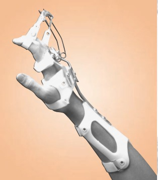
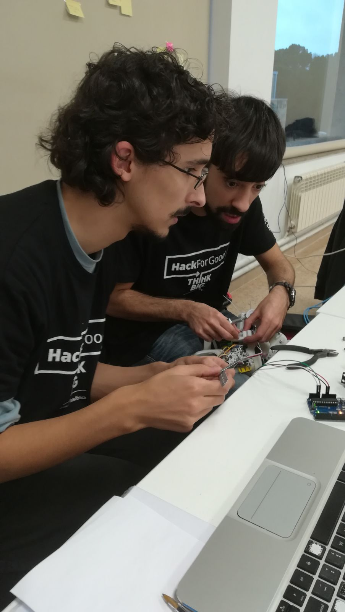
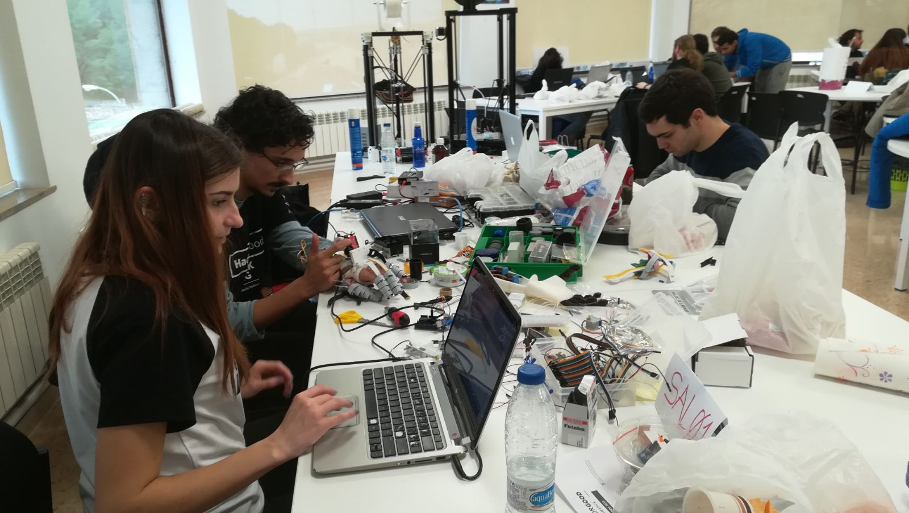
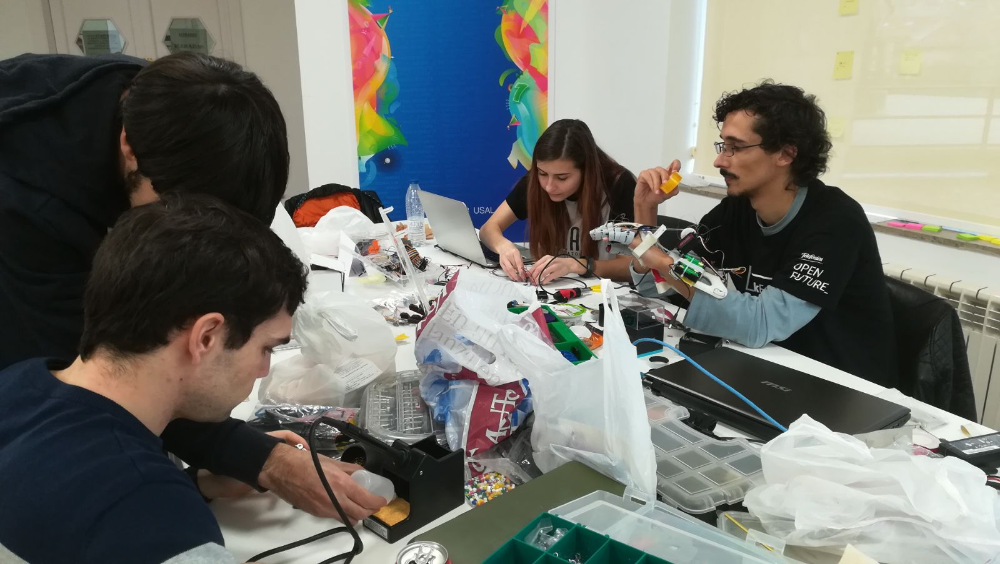

# BionicLabH4G
 
**_Exoesqueleto de mano para rehabilitación y recuperación de la funcionalidad_**

**RETO**\
Se propone realizar el prototipo de un exoesqueleto que permita a personas con movilidad reducida en una mano recuperar la funcionalidad de la misma en su vida cotidiana, así como realizar ejercicios de rehabilitación.

**NECESIDAD**\
Solo en España hay más de 3000 personas que tienen algún tipo de discapacidad en las extremidades superiores que les impiden su uso de forma parcial o completa, como es el caso de la espasticidad. Este tipo de afecciones merman de forma considerable la calidad de vida de estas personas, las cuales pierden funcionalidad, teniendo la necesidad en muchos casos de la ayuda de una tercera persona. Desde hace años, una de las principales soluciones a este problema es ir a un centro de rehabilitación para intentar ejercitar dicha extremidad y evitar que se pierda la poca movilidad que queda así como otros problemas derivados como puede ser el acortamiento de los tendones. El principal problema es que las sesiones son cortas y distantes en el tiempo, por ello se usan férulas que inmovilizan al paciente, que en unos casos no funcionan y en los que funcionan no permiten la utilización de la mano.

También puedes ver el reto [aqui](https://hackforgood.net/exoesqueleto-de-mano-para-rehabilitacion-y-recuperacion-de-la-funcionalidad/)

### Desarrollo

